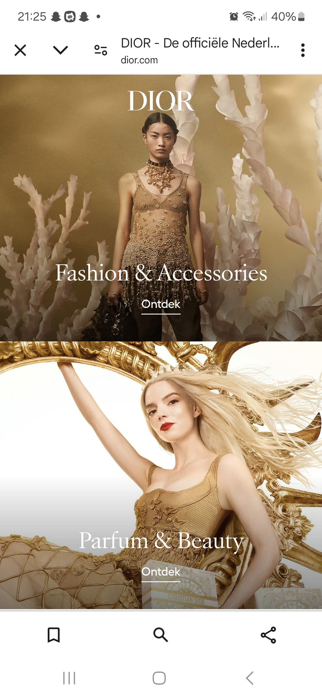
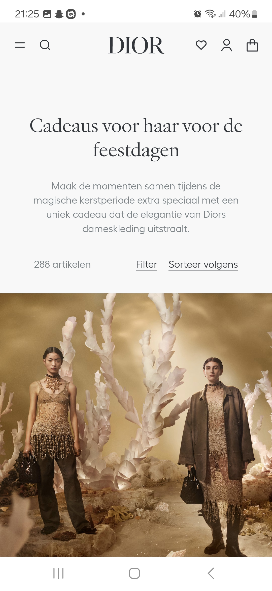
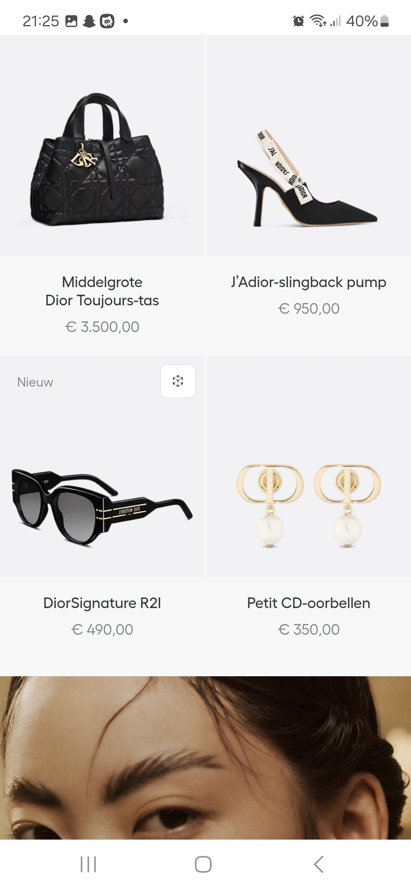
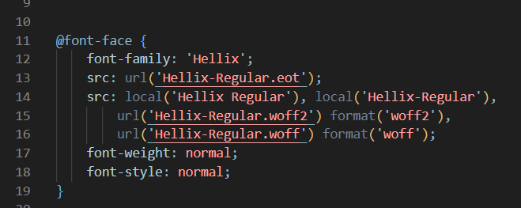

# Procesverslag
Markdown is een simpele manier om HTML te schrijven.  
Markdown cheat cheet: [Hulp bij het schrijven van Markdown](https://github.com/adam-p/markdown-here/wiki/Markdown-Cheatsheet).

Nb. De standaardstructuur en de spartaanse opmaak van de README.md zijn helemaal prima. Het gaat om de inhoud van je procesverslag. Besteedt de tijd voor pracht en praal aan je website.

Nb. Door *open* toe te voegen aan een *details* element kun je deze standaard open zetten. Fijn om dat steeds voor de relevante stuk(ken) te doen.

## Jij

  
uitwerken voor kick-off werkgroep

  ### Auteur:
  Lieke Pieterse

  #### Je startniveau:
  Rood

  #### Je focus:
  Surface plane
 

## Je website

  
uitwerken voor kick-off werkgroep

  ### Je opdracht:
  https://www.dior.com/nl_nl?wiz_campaign=OD_OTH_NLD_AO_OTH_DIOR_OGOING_AW_TXT_GGL_CRD_DUT_EUR_EXTM_BRA&wiz_source=bing&wiz_medium=search_cpc&wiz_term=OneDior-Exact&wiz_content=dior&msclkid=e1ef4cfde629145c485a2bcf83f7abcd&utm_source=bing&utm_medium=cpc&utm_campaign=OD_OTH_NLD_AO_OTH_DIOR_OGOING_AW_TXT_GGL_CRD_DUT_EUR_EXTM_BRA&utm_term=dior&utm_content=OneDior-Exact

  #### Screenshot(s) van de eerste pagina (small screen): 
  Home pagina Dior 
  

  #### Screenshot(s) van de tweede pagina (small screen):
  Cadeaus voor de feestdagen pagina Dior  
  
  
 

## Toegankelijkheidstest 1/2 (week 1)

  
uitwerken na test in 2e werkgroep

  ### Bevindingen
  Lijst met je bevindingen die in de test naar voren kwamen:
  de welkom op dior.com pop up knoppen doen het niet.
  hij stopt met de slides op de laatste, de slide doet het niet goed omdat het een groep is. de tekst is selecteerbaar. 
  In de slide is de link naar feestdagen cadeaus voor haar bijna niet te selecteren. Hij kan niet bij de filters, wel uitvouwen door op de knop te klikken maar kan niet filteren.
  De afbeeldingen hebben geen goede alt test. Je kan niet eens op de afbeelding klikken omdat er geen titel mee is om mee te werken. 
  Hij vertelt de prijs alleen als je hem alles laat voorlezen en niet met de pijltjes.
   
  Aller eerste pagina: Dior kop vertelt hij dubbel. Je kan alleen naar de pagina door op de video te klikken, maar de link van ontdek leest hij niet eens voor.
  de links hebben ook geen goede alt tekst.
  

  Een toegankelijkheids knop voor beter contrast onderaan de pagina.

  Uit de WCAG checklist komt dat de content niet toegankelijk is, dit komt door het gebruik van veel dure woorden zoals keperzijde om producten te beschrijven, hierdoor klinkt het duurde. Dit is echter lastig te veranderen omdat de producten alleen op die manier beschrijven kunnen worden.
  Verder had de HTML veel foutmeldingen. Dit heb ik gechecked in de console, want de link van de webstite deed het niet bij de HTML checker van WCAG.
  Verder waren de images ook heel slecht toegankelijk en hadden niet alle afbeeldingen een goede alt tekst.
  De video's beginnen wel met autoplay maar kunnen gepauzeerd worden.
  Het contrast was erg goed, dit komt omdat Dior hiervoor een toggle knop heeft om hoger contrast aan te zetten.
  Volgens de WCAG checklist kan Dior veel dingen beter doen op het gebied van toegankelijkheid, maar zijn er gelukkig ook een paar dingen die ze wel goed doen, zoals contrast en keyboard.

## Breakdownschets (week 1)

  
uitwerken na afloop 3e werkgroep

  ### de hele pagina: 
  

  ### dynamisch deel (bijv menu): 
  

  ### wellicht nog een dynamisch deel (bijv filter): 
  

## Voortgang 1 (week 2)

  
uitwerken voor 1e voortgang

  ### Stand van zaken
  hier dit ging goed & dit was lastig (neem ook screenshots op van delen van je website en code)
  Het hamburger menu is tot nu toe nog niet gelukt, maar ik moet nog even verder kijken of ik ergens een goede uitleg kan vinden voor hoe het precies gemaakt moet worden.

Font toepassen met @fontface is nog niet gelukt

  ### Agenda voor meeting
  samen met je groepje opstellen

  | student 1      
  |Mag je gewoon zelf een font kiezen dat er op lijkt of moet je echt hetzelfde font gebruiken.
  | student 2          | student 3    | student 4        |

  ### Verslag van meeting
  hier na afloop snel de uitkomsten van de meeting vastleggen

  - font kan gedowload worden door bij google te inspecteren en dan te kijken bij netwerk en dan font.
  - Als er een woord uit een andere taal is kan je dit aanpassen in de tekst zelf door hello
  - De product namen moeten H3tjes zijn en de H2 kan op hidden worden gezet door de code van a11y en dan de tekst die je op hidden wilt zetten de class van de css geven aan de tekst.

## Voortgang 2 (week 3)

  
uitwerken voor 2e voortgang

  ### Stand van zaken
  hier dit ging goed & dit was lastig (neem ook screenshots op van delen van je website en code)

  ### Agenda voor meeting
  samen met je groepje opstellen

  student 1               
Er mist een span in mijn hamburgermenu.
De h1 krijg ik niet verticaal ge centreerd op de video.
De pijltjes bij de details krijg ik niet weg.
De linkjes in de tekst onderaan de pagina staan raar.

  ### Verslag van meeting
  hier na afloop snel de uitkomsten van de meeting vastleggen

   -voor de hamburger moest ik de nth-child aanpassen naar nth-of-type en de top % van de tweede span aanpassen.
  -voor de header was het probleem dat de section waar de tekst in staat niet even groot is als de video. De manier om dit op t elossen is door de heigth van de section aan te passen.
  -Voor de pijltjes bij de details die ik niet weg kreeg is de oplossing de list-style-type none op de summary te zetten in plaats van de details.
  -voor de linkjes in de footer tekst stond er een algemene p met display flex waardoor hij alles op een nieuwe regel neerzette.

## Toegankelijkheidstest 2/2 (week 4)

  
uitwerken na test in 9e werkgroep

  ### Bevindingen
  Lijst met je bevindingen die in de test naar voren kwamen (geef ook aan wat er verbeterd is):

## Voortgang 3 (week 4)

  
uitwerken voor 3e voortgang

  ### Stand van zaken
  hier dit ging goed & dit was lastig (neem ook screenshots op van delen van je website en code)

  ### Agenda voor meeting
  samen met je groepje opstellen

  | student 1      | student 2          | student 3    | student 4        |
  | ---            | ---                | ---          | ---              |
  | dit bespreken  | en dit             | en ik dit    | en dan ik dat    |
  | en dat ook nog | dit als er tijd is | nog een punt | dit wil ik zeker |
  | ...            | ...                | ...          | ...              |

  ### Verslag van meeting
  hier na afloop snel de uitkomsten van de meeting vastleggen

 

## Eindgesprek (week 5)

  
uitwerken voor eindgesprek

  ### Je uitkomst - karakteristiek screenshots:
  

  ### Dit ging goed/Heb ik geleerd: 
  Korte omschrijving met plaatjes

  

  ### Dit was lastig/Is niet gelukt:
  Korte omschrijving met plaatjes

  

## Bronnenlijst

  
continu bijhouden terwijl je werkt

  Nb. Wees specifiek ('css-tricks' als bron is bijv. niet specifiek genoeg). 
  Nb. ChatGpT en andere AI horen er ook bij.
  Nb. Vermeld de bronnen ook in je code.

  1. bron 1
  2. bron 2
  3. ...

