# Procesverslag
Markdown is een simpele manier om HTML te schrijven.  
Markdown cheat cheet: [Hulp bij het schrijven van Markdown](https://github.com/adam-p/markdown-here/wiki/Markdown-Cheatsheet).

Nb. De standaardstructuur en de spartaanse opmaak van de README.md zijn helemaal prima. Het gaat om de inhoud van je procesverslag. Besteedt de tijd voor pracht en praal aan je website.

Nb. Door *open* toe te voegen aan een *details* element kun je deze standaard open zetten. Fijn om dat steeds voor de relevante stuk(ken) te doen.

## Jij

  
uitwerken voor kick-off werkgroep

  ### Auteur:
  Lieke Pieterse

  #### Je startniveau:
  Rood

  #### Je focus:
  Surface plane
 

## Je website

  
uitwerken voor kick-off werkgroep

  ### Je opdracht:
  https://www.dior.com/nl_nl?wiz_campaign=OD_OTH_NLD_AO_OTH_DIOR_OGOING_AW_TXT_GGL_CRD_DUT_EUR_EXTM_BRA&wiz_source=bing&wiz_medium=search_cpc&wiz_term=OneDior-Exact&wiz_content=dior&msclkid=e1ef4cfde629145c485a2bcf83f7abcd&utm_source=bing&utm_medium=cpc&utm_campaign=OD_OTH_NLD_AO_OTH_DIOR_OGOING_AW_TXT_GGL_CRD_DUT_EUR_EXTM_BRA&utm_term=dior&utm_content=OneDior-Exact

  #### Screenshot(s) van de eerste pagina (small screen): 
 Cadeaus voor de feestdagen pagina Dior  
  
  

  #### Screenshot(s) van de tweede pagina (small screen):
  Product detail pagina  
  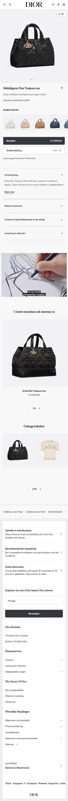

## Toegankelijkheidstest 1/2 (week 1)

  
uitwerken na test in 2e werkgroep

  ### Bevindingen
  Lijst met je bevindingen die in de test naar voren kwamen:
  de welkom op dior.com pop up knoppen doen het niet.
  hij stopt met de slides op de laatste, de slide doet het niet goed omdat het een groep is. de tekst is selecteerbaar. 
  In de slide is de link naar feestdagen cadeaus voor haar bijna niet te selecteren. Hij kan niet bij de filters, wel uitvouwen door op de knop te klikken maar kan niet filteren.
  De afbeeldingen hebben geen goede alt test. Je kan niet eens op de afbeelding klikken omdat er geen titel mee is om mee te werken. 
  Hij vertelt de prijs alleen als je hem alles laat voorlezen en niet met de pijltjes.
   
  Aller eerste pagina: Dior kop vertelt hij dubbel. Je kan alleen naar de pagina door op de video te klikken, maar de link van ontdek leest hij niet eens voor.
  de links hebben ook geen goede alt tekst.
  

  Een toegankelijkheids knop voor beter contrast onderaan de pagina.

  Uit de WCAG checklist komt dat de content niet toegankelijk is, dit komt door het gebruik van veel dure woorden zoals keperzijde om producten te beschrijven, hierdoor klinkt het duurde. Dit is echter lastig te veranderen omdat de producten alleen op die manier beschrijven kunnen worden.
  Verder had de HTML veel foutmeldingen. Dit heb ik gechecked in de console, want de link van de webstite deed het niet bij de HTML checker van WCAG.
  Verder waren de images ook heel slecht toegankelijk en hadden niet alle afbeeldingen een goede alt tekst.
  De video's beginnen wel met autoplay maar kunnen gepauzeerd worden.
  Het contrast was erg goed, dit komt omdat Dior hiervoor een toggle knop heeft om hoger contrast aan te zetten.
  Volgens de WCAG checklist kan Dior veel dingen beter doen op het gebied van toegankelijkheid, maar zijn er gelukkig ook een paar dingen die ze wel goed doen, zoals contrast en keyboard.

## Breakdownschets (week 1)

  
uitwerken na afloop 3e werkgroep

  ### de hele pagina: 
  

  ### dynamisch deel (Filter): 
  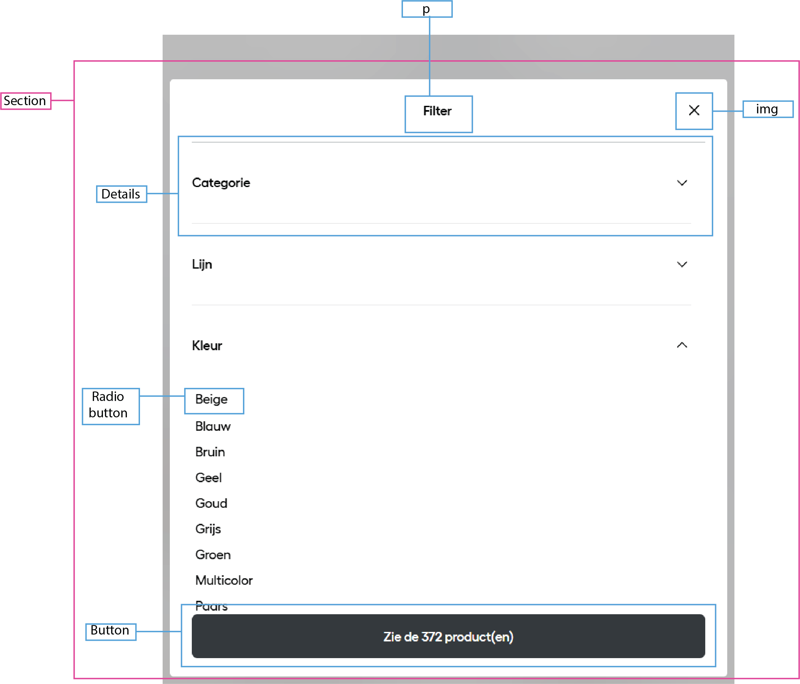

  ### De tweede product detail pagina
  

## Voortgang 1 (week 2)

  
uitwerken voor 1e voortgang

  ### Stand van zaken
  hier dit ging goed & dit was lastig (neem ook screenshots op van delen van je website en code)
  Het hamburger menu is tot nu toe nog niet gelukt, maar ik moet nog even verder kijken of ik ergens een goede uitleg kan vinden voor hoe het precies gemaakt moet worden.

Font toepassen met @fontface is nog niet gelukt

  ### Agenda voor meeting
  samen met je groepje opstellen

 student 1      
Mag je gewoon zelf een font kiezen dat er op lijkt of moet je echt hetzelfde font gebruiken.

  ### Verslag van meeting
  hier na afloop snel de uitkomsten van de meeting vastleggen

  - font kan gedowload worden door bij google te inspecteren en dan te kijken bij netwerk en dan font.
  - Als er een woord uit een andere taal is kan je dit aanpassen in de tekst zelf door hello
  - De product namen moeten H3tjes zijn en de H2 kan op hidden worden gezet door de code van a11y en dan de tekst die je op hidden wilt zetten de class van de css geven aan de tekst.

## Voortgang 2 (week 3)

  
uitwerken voor 2e voortgang

  ### Stand van zaken
  hier dit ging goed & dit was lastig (neem ook screenshots op van delen van je website en code)
  Ik liep deze week vooral vast met de header en de video en het hamburgermenu. Wat wel heel goed ging was aan de hand van grid de producten lijkst neerszetten en de lay-out aan te passen met @media (min-width: 1024px)
  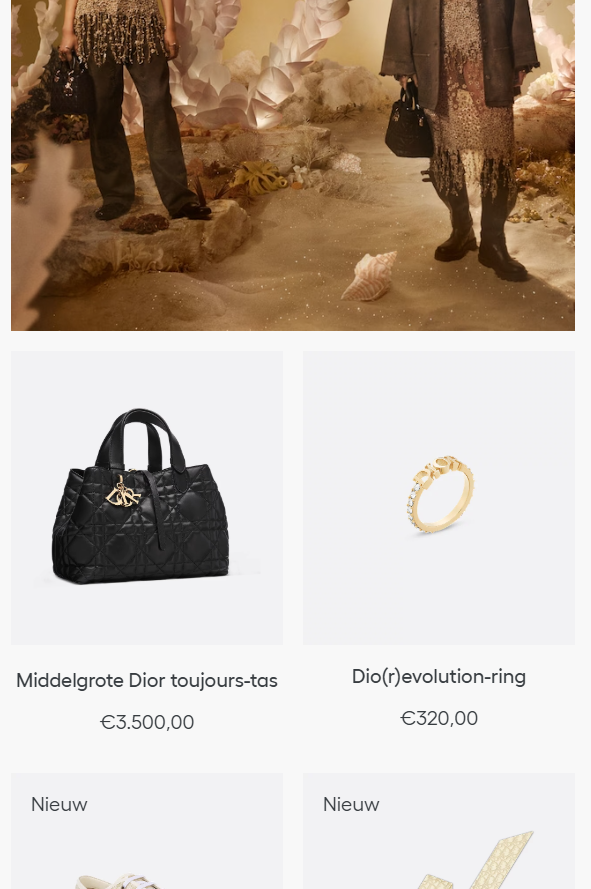
  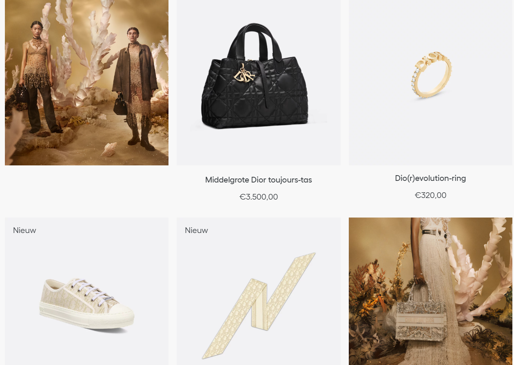

  ### Agenda voor meeting
  samen met je groepje opstellen

  student 1               
Er mist een span in mijn hamburgermenu.
De h1 krijg ik niet verticaal ge centreerd op de video.
De pijltjes bij de details krijg ik niet weg.
De linkjes in de tekst onderaan de pagina staan raar.

  ### Verslag van meeting
  hier na afloop snel de uitkomsten van de meeting vastleggen

   -voor de hamburger moest ik de nth-child aanpassen naar nth-of-type en de top % van de tweede span aanpassen.
  -voor de header was het probleem dat de section waar de tekst in staat niet even groot is als de video. De manier om dit op t elossen is door de heigth van de section aan te passen.
  -Voor de pijltjes bij de details die ik niet weg kreeg is de oplossing de list-style-type none op de summary te zetten in plaats van de details.
  -voor de linkjes in de footer tekst stond er een algemene p met display flex waardoor hij alles op een nieuwe regel neerzette.

## Toegankelijkheidstest 2/2 (week 4)

  
uitwerken na test in 9e werkgroep

  ### Bevindingen
  Lijst met je bevindingen die in de test naar voren kwamen (geef ook aan wat er verbeterd is):
  Uit de checklist is gebleken dat ik bij de globale code overal yes heb, terwijl dit bij de Dior website niet het geval is. De Dior website heeft heel veel errors en warnings, en mijn code heeft 0 errors. 
  Bij mobile and touch hebben mijn website en de Dior website even veel yes, maar ik heb een no bij remove horizontal scrolling en de dior website heeft bij ensure sufficient space between interactive items in order to provide a scroll area een no.
  Bij heading heb ik bij alles yes, terwijl Dior een no heeft.
  Bij images heb ik een stuk beter gepresteerd dan de Dior website. De Dior website heeft overal no, dit komt deels omdat er geen graphs zijn. Ik heb ook geen graphs en heb daarom daar ook no, verder heb ik ook no bij decorative items een 0 als alt text omdat ik geen decorative items heb. Op alle dingen die ik wel op mijn pagina's heb, heb ik wel yes.
  Bij appearance heb ik ook beter gescoord omdat de text naar 200% kan gezet worden en dan nog steeds leesbaar is, terwijl dit bij de Dior website een no is. Verder heb ik ook een dark en light mode terwijl die ook niet in de Dior website zijn. 
  Verder hebben mijn website en de Dior website op de meeste dingen hetzelfde gescoord.

## Voortgang 3 (week 4)

  
uitwerken voor 3e voortgang

  ### Stand van zaken
  hier dit ging goed & dit was lastig (neem ook screenshots op van delen van je website en code)
  Ik ben deze week begonnen aan mijn tweede pagina. Hier liep ik op tegen een aantal dingen zoals de carrousels en de java voor het muten van de video. Wat wel gelukt is, is om op de eerste pagina al mijn uitklap veldjes, zoals de filter, de sorteren en het hamburgermenu.
  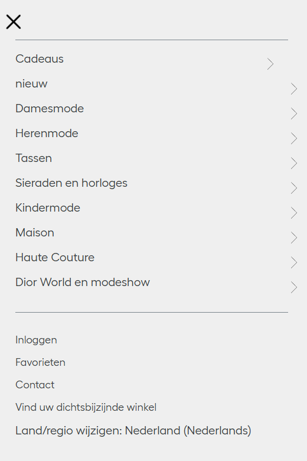
  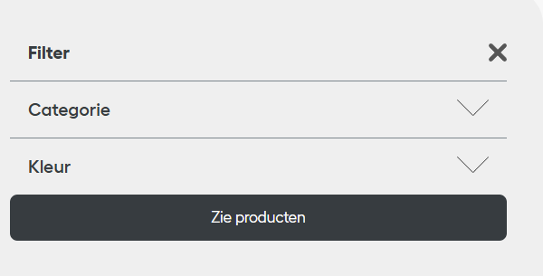

  ### Agenda voor meeting
  samen met je groepje opstellen

  | student 1 
  Hoe kan ik de onlangs bekeken slider per twee laten snappen?
  Hoe moet ik de video muten?
  Moet ik alles linken naar de echte dior pagina of kunnen het gewoon dode linkjes blijven?
  Is het lastig om een filter werkend te maken?

  ### Verslag van meeting
  Ik moet voor alle carousels een balkje toevoegen om mee te sliden. Ook weet ik nu dat ik voor de carrousel met twee images main section:nth-of-type(6) ul li:nth-of-type(2n + 1) {
    scroll-snap-align: start;
} moet gebruiken om ze te laten snappen.
Ook heb ik geleerd hoe je een video kan muten aan de hand van img en java script. 
Niet alle linkjes hoeven te werken, alleen de link naar de andere pagina die je zelf gemaakt heb. 
Ik heb geleerd dat je een filer kan laten werken door html:has([value="tas"]:checked) section:nth-of-type(3) ul li:not(.tas){
  display: none;
} in de css te zetten en <label>
							<input type="radio" value="tas" name="categorie">tas
						</label> in de html.
Verder heb ik ook geleerd hoe je ervoor kan zorgen dat als een venster is uitgeklapt zoals het hamburger menu, je in het menu kan scrollen in plaats van op de pagina daarachter dit doe je met  overflow-y: auto.

 

## Eindgesprek (week 5)

  
uitwerken voor eindgesprek

  ### Je uitkomst - karakteristiek screenshots:
  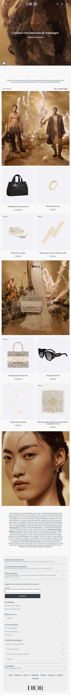
  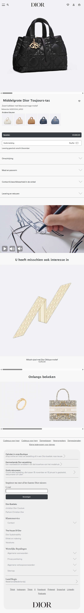

  ### Dit ging goed/Heb ik geleerd: 
Ik ben vooral blij met mijn producten lijst. Ik heb hier voor het eerst gebruik gemaakt van grid en media query, en ik ben blij met hoe het is gelukt. Ook heb ik bij mijn producten lijst een werkende filter en een werkende sorteer volgens. Voor deze twee heb ik geleerd gebruik te maken van :has().

  
  
    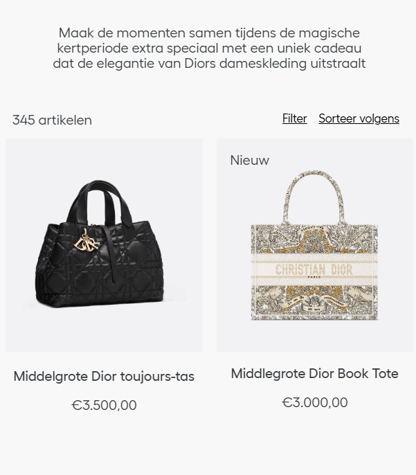
  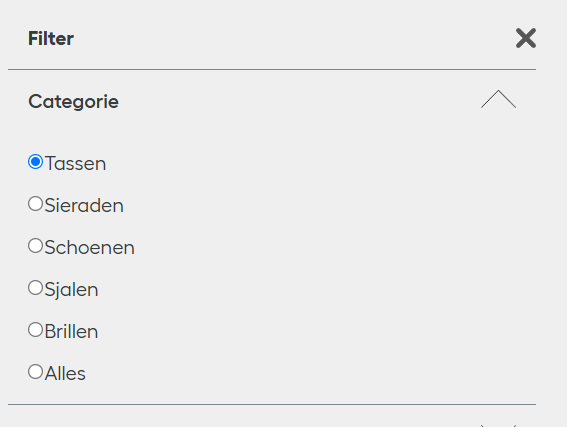

  Wat ik ook geleerd heb is om een aniatie te maken aan de hand van keyframes en verder te weken met :has(). Dit is te zien in mijn kert thema waar als je een checkbox in de header checked er kerstbal slingers aan de bovenkant van de pagina komen te hangen en er met een delay een kerstman met zijn slee en een rendier over het scherm van rechts naar links vliegt.
  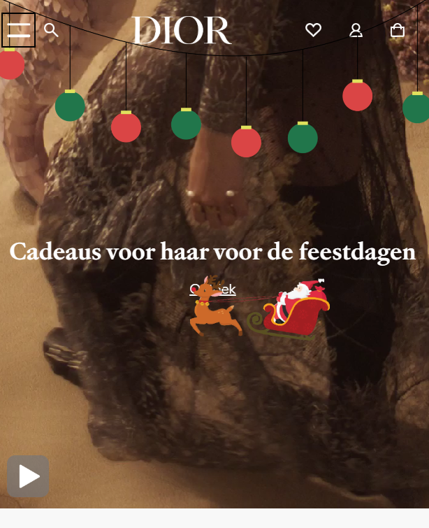

  ### Dit was lastig/Is niet gelukt:
  Wat mij niet gelukt is, is de kleur van de spans in het menu aanpassen voor darkmode.
  Ik heb andere dingen wel kunnen aanpassen, maar als ik dezelfde manier gebruikte voor de spans veranderde er nikst. Ik had het liefsts de spans wit willen maken, als menu en als kruisje.

  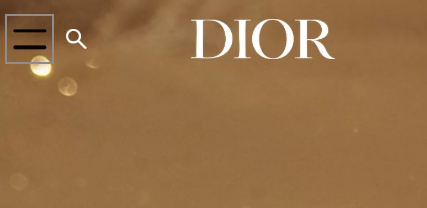
   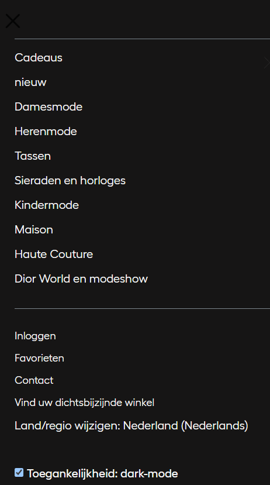

## Bronnenlijst

  
continu bijhouden terwijl je werkt

  Nb. Wees specifiek ('css-tricks' als bron is bijv. niet specifiek genoeg). 
  Nb. ChatGpT en andere AI horen er ook bij.
  Nb. Vermeld de bronnen ook in je code.

  1. Bron: chat gpt - prompt:ik heb in een button twee woorden staan, 
kan ik een van die woorden aan de linker kant plaatsen en de ander aan de rechtekant.  
<button>Bestellen €3.500,00</button>
Deze bron heb ik gebruikt om op mijn tweede pagina de tekst in een button vorm te geven zodat een deel van de tekst aan de linkerkant staat en het andere deel aan de rechtekant.

  2. bron: https://www.a11yproject.com/posts/how-to-hide-content/
  Deze bron heb ik gebruikt voor de class visually hidden om tekst te verbergen, maar het wel toegankelijk te houden.

  3. Hamburger menu bron: https://youtu.be/aNDqzlAKmZc?si=_QBkHuhMWLj0btXJ
  Deze bron heb ik gebruikt om mijn hamburger menu te maken.

  4. play pause button pagina 1 bron: chatgpt
  Deze bron heb ik gebruikt om de play en pauze buttons voor mijn video's te laten werken en elkaar af te laten wisslen.

